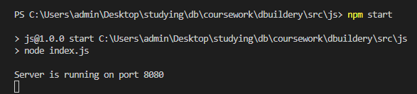
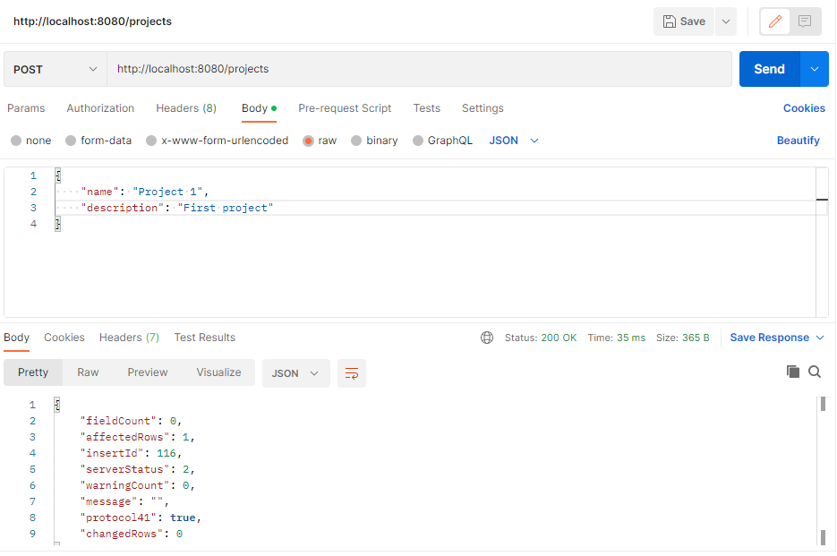

# Тестування працездатності системи

Для тестування було використано застосунок Postman.

Був реалізований доступ до таблиці PROJECT.

# Запуск сервісу

  

# Відображення усіх сутностей (GET)

*Пуста таблиця.*

  

# Додавання сутностей (POST)

  

  

*Помилка, якщо одне з полів не вказане.*

  

*Помилка, якщо вказується уже існуюче ім'я.*

  

# Відображення за ID (GET)

  

*Помилка, якщо вказується неіснуючий ідентифікатор.*

  

# Онолення сутності (PUT)

  

  

*Помилка, якщо не вказане одне з полів*

  

# Видалення сутності (DELETE)

  

  

*Помилка, якщо вказується неіснуючий ідентифікатор*

  

